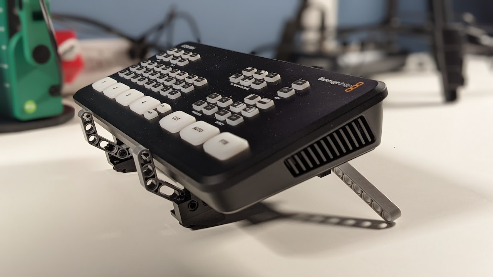
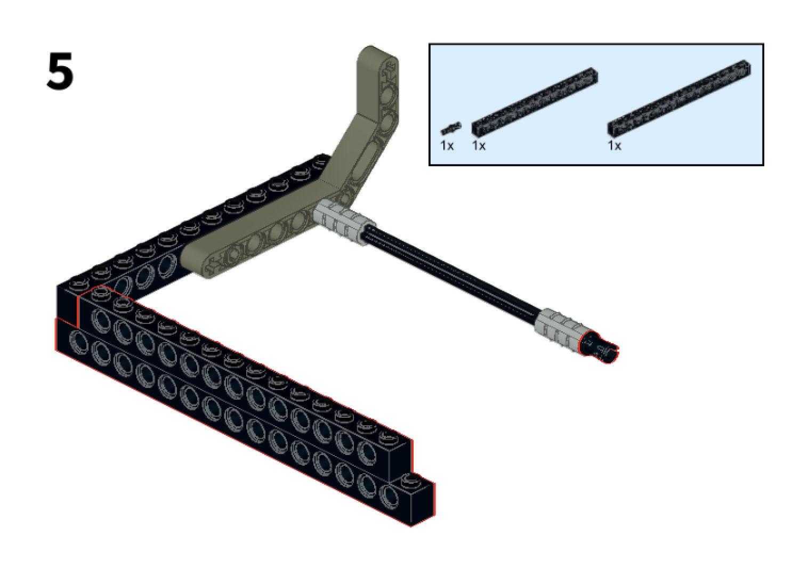

Have an ATEM Mini/Pro/ISO (or soon [to purchase one](https://amzn.to/3EKT0ye)?), you need a stand. [Commercial stands](https://ebay.us/zU6B1V) are pricey but LEGO fans, like me, can scrounge up elements to build their your own when they get my instructions found at:

<https://www.buymeacoffee.com/retroCombs/e/51612>

Below is a full video that provides the background on my stand that was my LEGO Build Day 2021 project.

  
<iframe src="https://www.youtube.com/embed/FRaoA08bGP4" frameborder="0" allowfullscreen style="position:absolute;top:0;left:0;width:100%;height:100%;"></iframe>

Here's a sample page from the instructions:

You can get your instructions on my Buy Me a Coffee page at:

<https://www.buymeacoffee.com/retroCombs/e/51612>

You can purchase the set outright, or if you become a retroCombs member (even at the $1 Commodore PET level), you can get it for free!

## FAQ

**Q: Where do I get the rubber feet?**

A: Amazon Basics Self Adhesive Bumper Pads will work. Get them [here](https://amzn.to/3Hsae5g).

**Q: Is the dock height adjustable?**

A: Yes! See the instructions and video.

**Q: Is there an existing set that you recommend to get me started?**

A: No. I put this together from my Technic collection. You might check current Technic sets.

**Q: What if I can't find a part I need in my stash?**

A: I recommend [Bricklink](http://www.bricklink.com) where you can purchase single elements! The other alternative is to improvise. Look for other parts that serve the same purpose. That's part of the LEGO fun and you may find that your version is better than mine! If you do, send me an [email](retrocombs@icloud.com) with a pic.

## Errata

None as of 2022-01-01